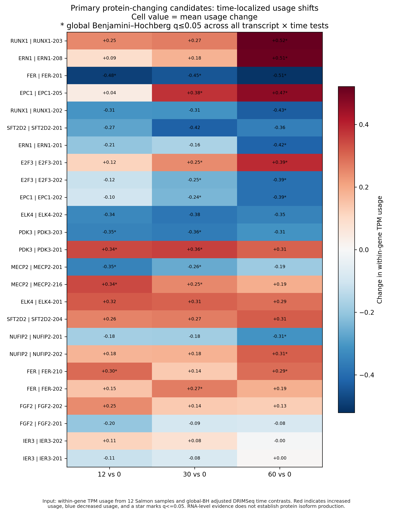

# Results index

## Current presentation-ready figures

Open
[`dtu_v2/primary_candidate_timepoint_statistics/`](dtu_v2/primary_candidate_timepoint_statistics/)
for the current summary heatmap, all 12 replicate-aware candidate figures and
their exact plotting source tables.

## Current accepted results

- `dtu_v2/`: primary differential transcript usage analysis, robustness checks,
  protein-sequence validation, time-point contrasts, figures and source data.
- `gene_expression_time/`: complementary gene-level DESeq2 categorical-time
  likelihood-ratio test.
- `qc/`: Salmon input and sample-level quality-control audits.

Start with `dtu_v2/analysis_status.md`.

## Superseded results retained for provenance

The top-level CSV files in this directory and `suppa2/` belong to the earlier
preliminary workflow. They are not the current primary result. See
`../LEGACY_ANALYSES.md` before using them.
