# Primary candidate time-point statistics

These figures use all 12 Salmon samples (three biological samples at each of
0, 12, 30 and 60 minutes). Statistical models retain the individual samples;
means are drawn only as descriptive visual guides.

## Files

- `primary_candidate_timepoint_heatmap.png/pdf`: rows are transcripts, columns
  are time-vs-0 contrasts, cell values are mean changes in within-gene TPM
  usage, red is increase, blue is decrease, and `*` indicates global
  Benjamini-Hochberg false discovery rate adjusted q <= 0.05.
- `<GENE>_dtu_statistics.png`: left panel shows total gene TPM; right panel
  shows transcript TPM divided by total gene TPM. Faint points are individual
  samples and connected opaque points are display means.
- `primary_candidate_replicate_values.tsv`: source data for every plotted
  replicate point.
- `primary_candidate_timepoint_statistics.tsv`: effect sizes, raw likelihood-
  ratio-test p-values and global Benjamini-Hochberg adjusted q-values.

Detailed statistical interpretation is in
`../../../docs/figure_and_statistics_guide.md`.

## Candidate figures

| Gene | Replicate-aware figure | Time-localized global-BH result |
|---|---|---|
| RUNX1 | `RUNX1_dtu_statistics.png` | RUNX1b decreases and RUNX1a increases at 60 min |
| ERN1 | `ERN1_dtu_statistics.png` | reciprocal ERN1-201/208 change at 60 min |
| FER | `FER_dtu_statistics.png` | FER-201 decreases at 12/30/60 min; shorter transcripts increase at selected times |
| EPC1 | `EPC1_dtu_statistics.png` | reciprocal EPC1-202/205 change at 30/60 min |
| SFT2D2 | `SFT2D2_dtu_statistics.png` | omnibus candidate; no individual global-BH time contrast |
| E2F3 | `E2F3_dtu_statistics.png` | reciprocal E2F3-201/202 change at 30/60 min |
| ELK4 | `ELK4_dtu_statistics.png` | omnibus candidate; no individual global-BH time contrast |
| PDK3 | `PDK3_dtu_statistics.png` | reciprocal PDK3-201/203 change at 12/30 min |
| MECP2 | `MECP2_dtu_statistics.png` | reciprocal MECP2-201/216 change at 12/30 min |
| NUFIP2 | `NUFIP2_dtu_statistics.png` | reciprocal NUFIP2-201/202 change at 60 min |
| FGF2 | `FGF2_dtu_statistics.png` | omnibus candidate; no individual global-BH time contrast |
| IER3 | `IER3_dtu_statistics.png` | omnibus candidate; no individual global-BH time contrast |

“Reciprocal” refers to within-gene transcript usage: when one transcript's
share increases, another transcript's share may decrease. It does not by itself
imply that total gene abundance is unchanged.

Biological interpretation and literature evidence are documented separately in
`../../../docs/biological_interpretation.md`. Absence of direct isoform
literature is reported as a knowledge gap rather than converted into evidence.

## Figure gallery with presentation captions

All panels below were generated reproducibly with Python, pandas and Matplotlib
by `scripts/plot_primary_dtu_statistics.py`; they were not manually drawn or
edited. Inputs are the 12 deposited Salmon `quant.sf` files and the statistical
tables produced by the R/DRIMSeq and stageR workflow. In gene panels, the left
side is descriptive total gene TPM and the right side is within-gene transcript
usage. Faint points are individual biological samples, connected solid points
are display means only, and a star marks a time-vs-0 contrast with global
Benjamini-Hochberg q <= 0.05 across all 75,477 transcript-by-time tests.

### Summary heatmap

**Caption.** Input: TPM estimates from all 12 Salmon samples and global-BH
adjusted DRIMSeq time contrasts. Each row is a robust coding transcript and each
cell is the mean change in its within-gene TPM share relative to 0 minutes. Red
indicates increased usage, blue indicates decreased usage, and a star denotes a
globally significant time-specific contrast. The heatmap shows early, sustained
and late response patterns; it is RNA-level evidence and not proof of protein
isoform production.

### RUNX1

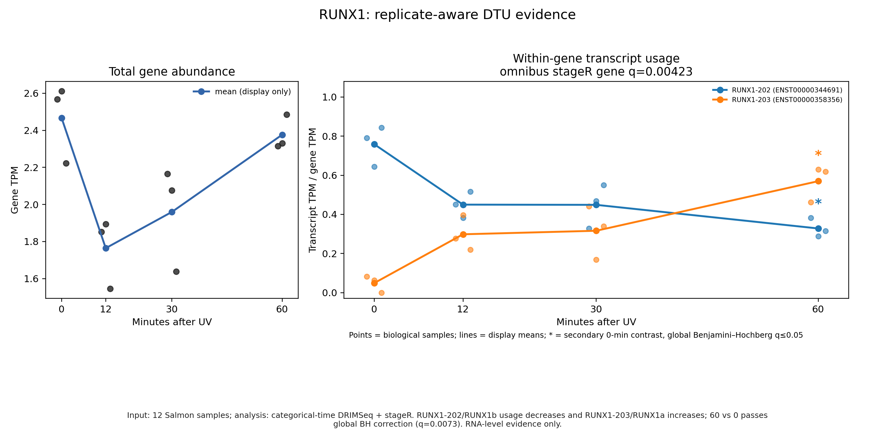

**Caption.** Input: three Salmon samples at each of 0, 12, 30 and 60 minutes.
The categorical-time DRIMSeq/stageR omnibus test supports RUNX1 DTU
(gene q = 0.00423). RUNX1-202/RUNX1b usage decreases while
RUNX1-203/RUNX1a usage increases; the 60-vs-0 contrast passes global BH
correction (q = 0.0073). The result supports an RNA-level RUNX1b-to-RUNX1a
usage shift, not a confirmed protein-level switch.

### E2F3

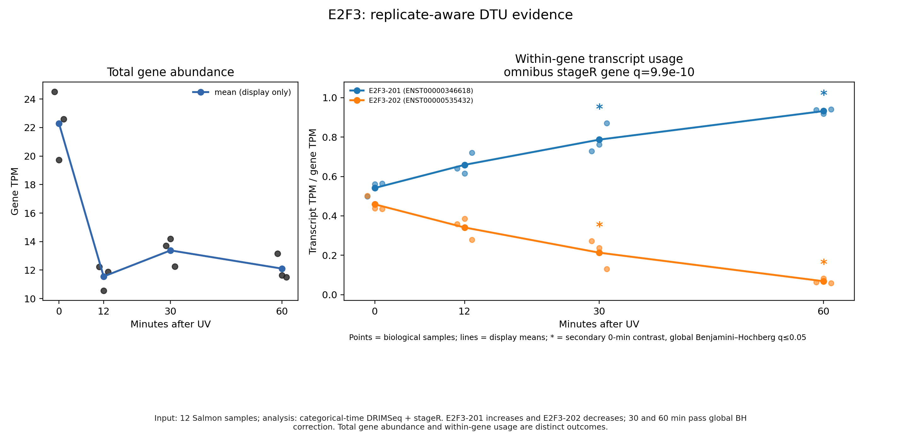

**Caption.** Input and plotting conventions are as described above. The
DRIMSeq/stageR omnibus test strongly supports E2F3 DTU (gene q = 9.9e-10).
E2F3-201 usage increases and E2F3-202 usage decreases; both 30- and 60-minute
contrasts pass global BH correction. Total gene TPM and transcript composition
are shown separately because differential expression and DTU are distinct
questions.

### FER

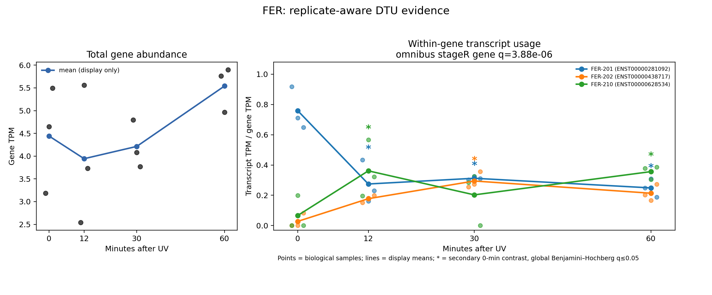

**Caption.** The DRIMSeq/stageR omnibus result supports FER DTU
(gene q = 3.88e-06). Full-length FER-201 usage decreases at 12, 30 and 60
minutes, each passing global BH correction. Shorter FER-202 and FER-210
transcripts increase at selected times. This is a statistically consistent
RNA-level composition change; the functions of the shorter products require
experimental validation.

### EPC1

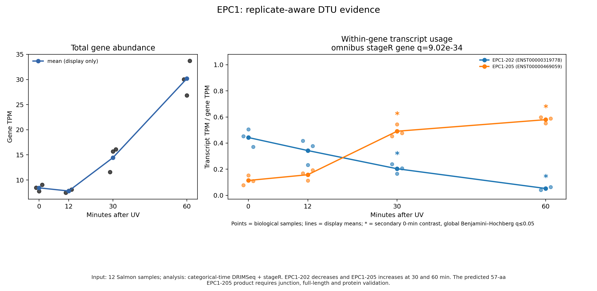

**Caption.** The DRIMSeq/stageR omnibus test strongly supports EPC1 DTU
(gene q = 9.02e-34). EPC1-202 usage decreases while the short coding annotation
EPC1-205 increases at 30 and 60 minutes; both times pass global BH correction.
Because EPC1-205 is predicted to encode only 57 amino acids, junction,
full-length transcript and protein validation are required before making a
functional protein-switch claim.

### ERN1

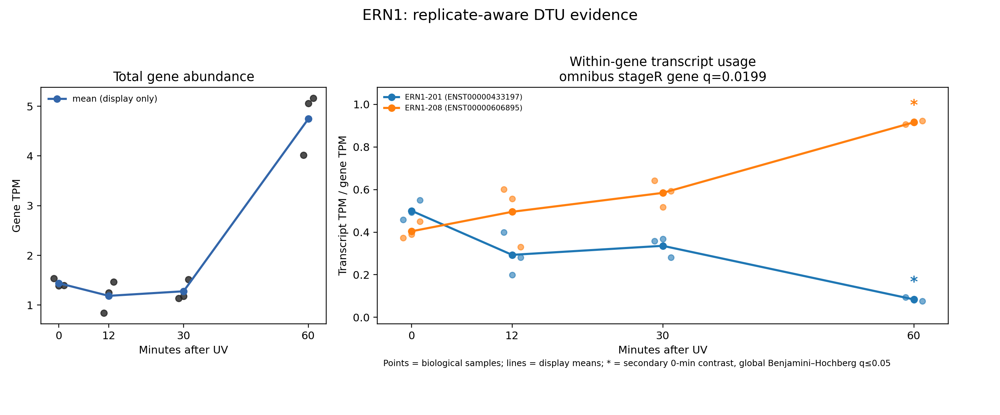

**Caption.** The DRIMSeq/stageR omnibus result supports ERN1 DTU
(gene q = 0.0199). Full-length ERN1-201 usage decreases and the short ERN1-208
annotation increases at 60 minutes (global BH q = 0.037). The reciprocal RNA
pattern is time localized, but the predicted 70-amino-acid product is not
established as a stable functional protein.

### MECP2

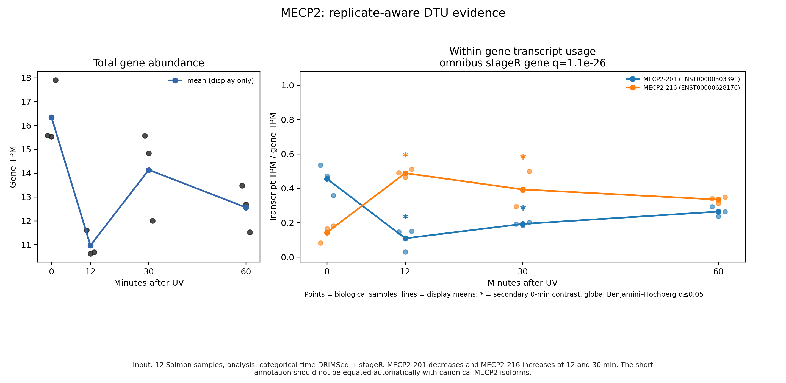

**Caption.** The DRIMSeq/stageR omnibus test strongly supports MECP2 DTU
(gene q = 1.10e-26). MECP2-201 usage decreases and MECP2-216 usage increases at
12 and 30 minutes after global BH correction, consistent with an early
transcript-composition response. The 172-amino-acid MECP2-216 annotation should
not be equated automatically with the canonical MECP2 isoform classes.

### PDK3

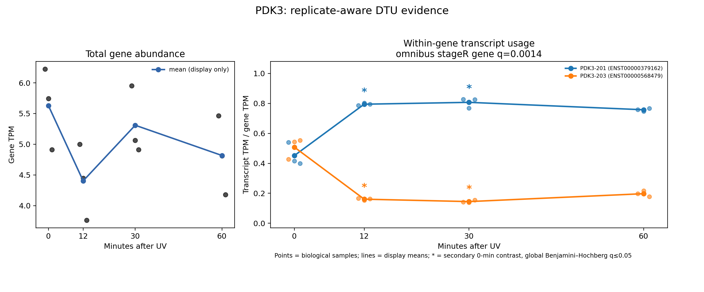

**Caption.** The DRIMSeq/stageR omnibus result supports PDK3 DTU
(gene q = 0.00140). PDK3-201 usage increases while PDK3-203 decreases at 12 and
30 minutes, with both contrasts passing global BH correction. The pattern is an
early RNA-level metabolic-stress candidate; a direct UV-DDR isoform mechanism
has not been established.

### NUFIP2

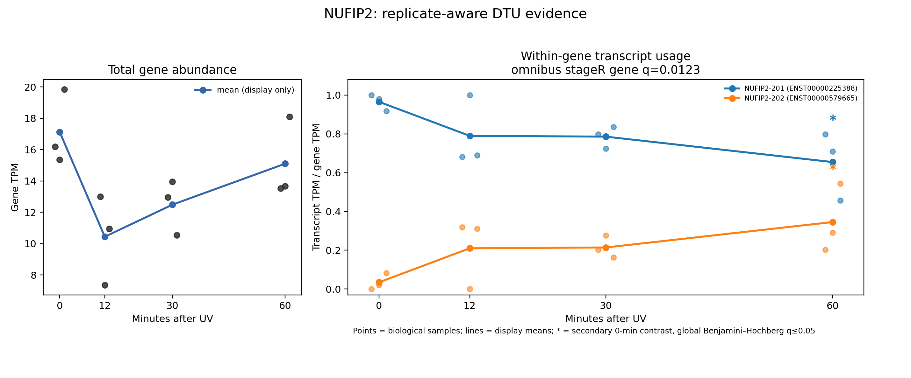

**Caption.** The DRIMSeq/stageR omnibus result supports NUFIP2 DTU
(gene q = 0.0123). NUFIP2-201 usage decreases and NUFIP2-202 usage increases at
60 minutes (global BH q = 0.0344), indicating a late RNA-level composition
shift. Direct UV-response and protein-product evidence for this transcript pair
is currently limited.

### ELK4

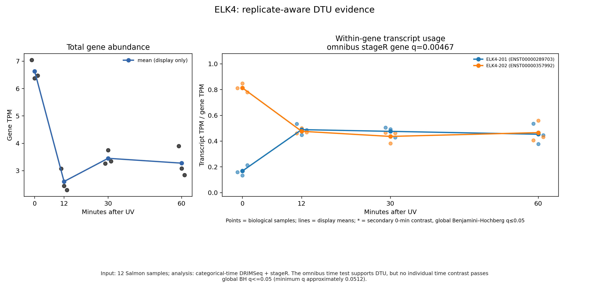

**Caption.** The four-time-point omnibus test supports ELK4 DTU
(gene q = 0.00467), and the plot shows a large reciprocal usage pattern.
However, no individual time-vs-0 contrast passes the prespecified global BH
q <= 0.05 threshold; the smallest global q is approximately 0.0512. ELK4 is
therefore an omnibus candidate without confidently localized timing.

### SFT2D2

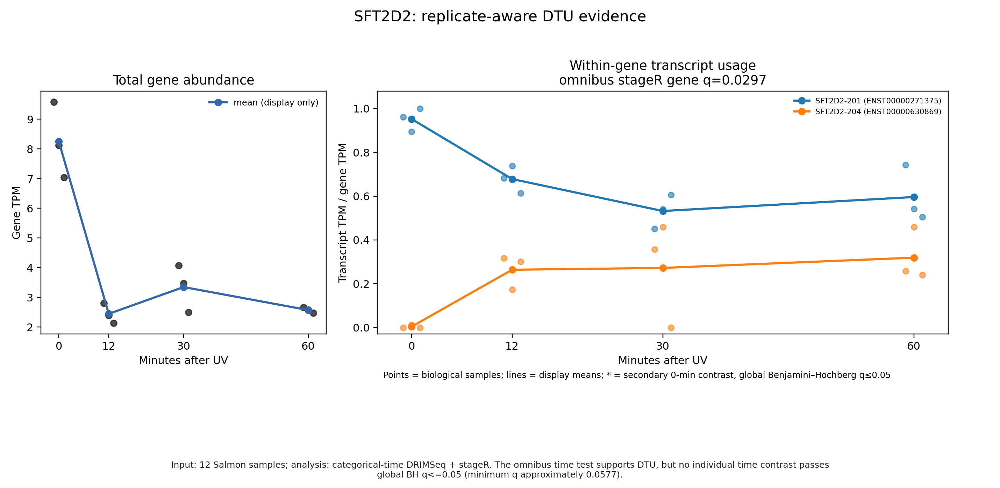

**Caption.** The categorical-time omnibus test supports SFT2D2 DTU
(gene q = 0.0297), and the descriptive effect sizes are substantial. No single
time-vs-0 contrast passes global BH q <= 0.05; the smallest global q is
approximately 0.0577. The figure supports an overall time association but not a
specific statistically localized time point.

### FGF2

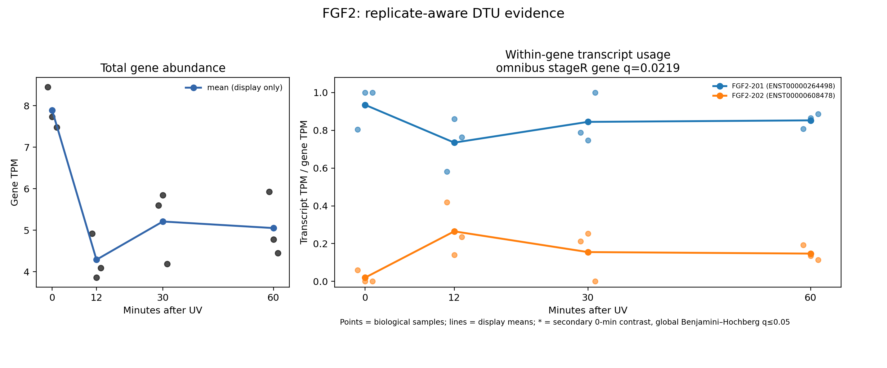

**Caption.** The categorical-time omnibus test supports FGF2 DTU
(gene q = 0.0219). The largest descriptive shift occurs at 12 minutes, but its
global q is approximately 0.0508 and therefore does not pass the prespecified
q <= 0.05 threshold. FGF2 is retained as an omnibus candidate, not as a
time-localized discovery; alternative translation initiation also complicates
direct mapping from transcript names to classic FGF2 protein isoforms.

### IER3 — interpretation warning

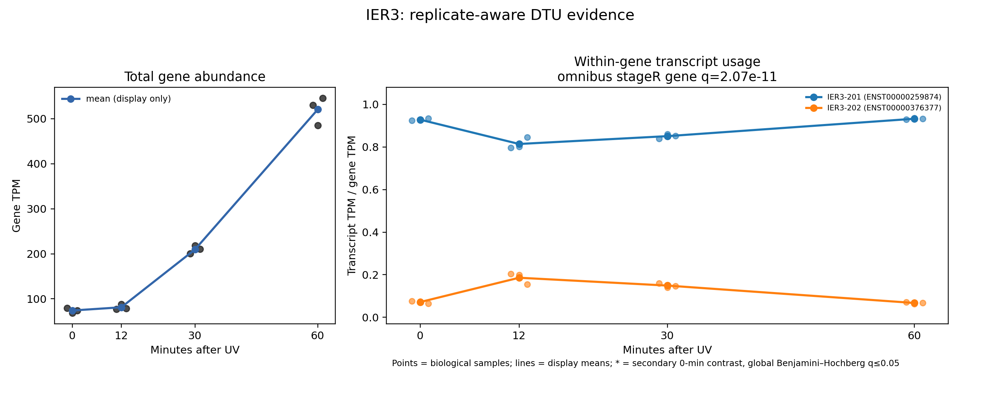

**Caption.** The plotted points are genuine Salmon-derived values, but both
displayed transcripts have an across-sample within-gene proportion SD of about
0.055, below the prespecified 0.10 safeguard. Their time-specific p-values were
therefore set to 1 and no time contrast is supported. IER3 remains visible for
auditability but should not be presented as a primary robust transcript-level
candidate until the candidate-selection rule is corrected and rerun.
